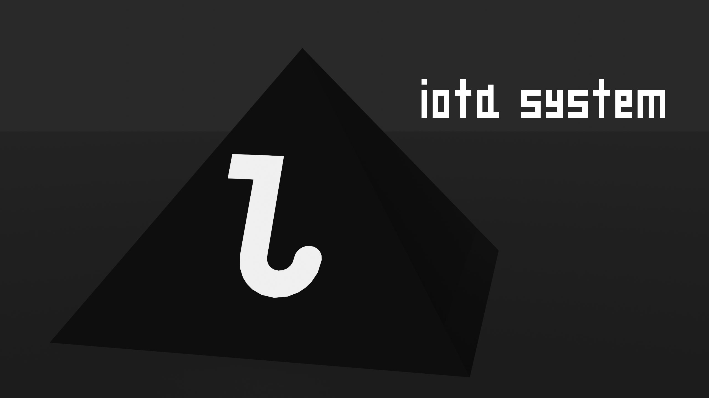

# Iota System



Iota System is an 8-bit-styled fantasy computer simulator. It provides a framework for users to create their own games and apps and share them with the world.

Iota System is early in development. [Join our Discord server](https://discord.gg/7eCYmjvCqr) to stay updated on Iota System's progress.

## Building
An early CMake build system has been set up.

```
git clone https://github.com/lordlydumbass/iota-system.git
cd iota-system/sdlAgain
mkdir build
cd build
cmake ..
ninja -j4
```
These are the steps I used for building on MINGW64 on Windows. Note the use of ninja. If you have GNU Make or a different build system, use that.

SDL3 is dynamically linked; the DLL must be placed in the same directory. I included it in the root of this repository and will soon adjust licensing to compensate.
